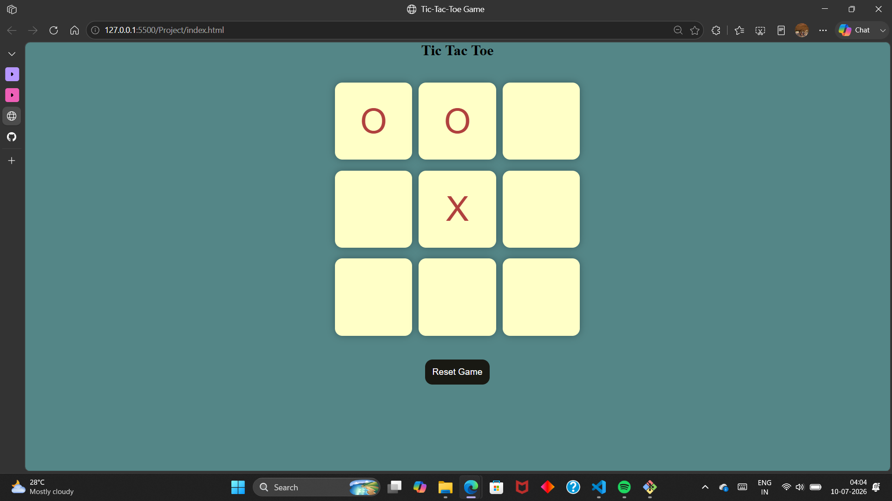
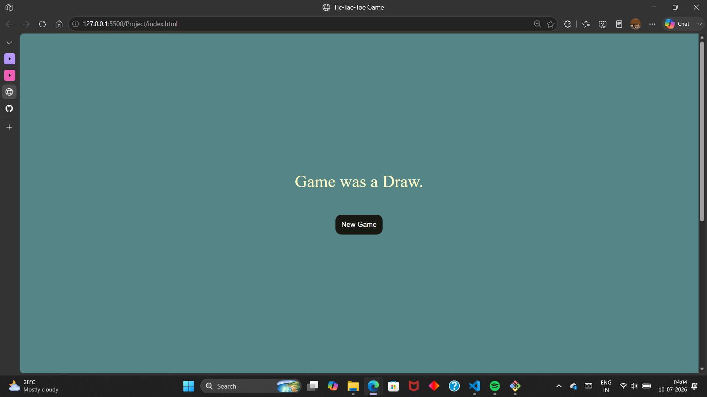
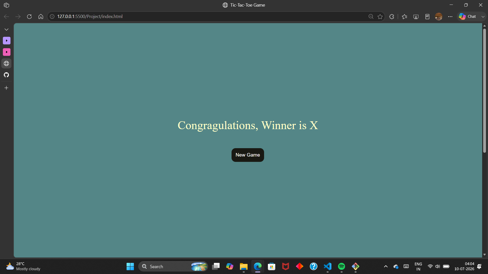

# tic-tac-toe-game
A simple and interactive Tic Tac Toe game built using HTML, CSS, JavaScript. This allows two players to play the classic Tic Tac Toe game in the browser with a clean and responsive user interface.

## Features
- Two player gameplay
- Automatic Winner Detection
- Draw Detection
- Reset Game Functionality
- New Game Functionality
- Responsive Design
- Easy-to-use interface

  ## Technogies Used
  - HTML
  - CSS
  - JavaScript
 
  ## Project Structure
  tic-tac-toe-game/
  |-- index.html
  |-- style.css
  |-- app.js
  |-- README.md

  ## How to Run
  1. Clone the repository:
     ```bash
     git clone https://github.com/kritiiiprasad-11/tic-tac-toe-game.git
     ```
  2. Open the project folder.
  3. Double click `index.html` or open it using Live Server in VS Code

  ## Screenshot

  # Gameplay
  

  # Draw Screen
  

  # Winner Screen
  


  ## Author

  KRITI PRASAD

  GitHub: https://github.com/kritiiiprasad-11
